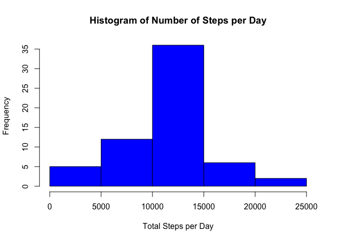

## Loading and preprocessing the data


```r
library(readr)
library(dplyr)
```

```
## 
## Attaching package: 'dplyr'
```

```
## The following objects are masked from 'package:stats':
## 
##     filter, lag
```

```
## The following objects are masked from 'package:base':
## 
##     intersect, setdiff, setequal, union
```

```r
library(ggplot2)
df<-read_csv('activity.zip')
```

```
## Parsed with column specification:
## cols(
##   steps = col_double(),
##   date = col_date(format = ""),
##   interval = col_double()
## )
```

```r
dfnoNA<-df[!is.na(df$steps),]
```


## What is mean total number of steps taken per day?


```r
s<-dfnoNA %>% group_by(date) %>% select(c(steps,interval)) %>% summarise(steps=sum(steps)) 
```

```
## Adding missing grouping variables: `date`
```

```r
hist(s$steps, col='blue', main='Histogram of Number of Steps per Day', xlab = 'Total Steps per Day')
```

<!-- -->

```r
sprintf('Mean number of steps per day: %f',mean(s$steps))
```

```
## [1] "Mean number of steps per day: 10766.188679"
```

```r
sprintf('Median number of steps per day: %f',median(s$steps))
```

```
## [1] "Median number of steps per day: 10765.000000"
```


## What is the average daily activity pattern?


```r
s2<-dfnoNA %>% group_by(interval) %>% select(c(steps,interval)) %>% summarise(steps=mean(steps))
with(s2, plot(x=interval,y=steps, type='l', xlab='Daily 5 Minute Interval'
             ,ylab='Average Number of Steps', main='Average Steps per Daily 5-Minute Interval'))
abline(v=s2$interval[which.max(s2$steps)], col='blue', lty = 3)
text(850,200, paste('Max @ interval',as.character(s2$interval[which.max(s2$steps)])), col = 2)
```

<!-- -->

```r
sprintf('Max steps taken on average at interval %i',s2$interval[which.max(s2$steps)])
```

```
## [1] "Max steps taken on average at interval 835"
```


## Imputing missing values


```r
sprintf('Rows with NA: %i',nrow(df[which(is.na(df$steps)),]))
```

```
## [1] "Rows with NA: 2304"
```

```r
s4<-dfnoNA %>% group_by(interval) %>% select(c(steps,interval)) %>% summarise(steps=mean(steps)) 
impdf<-rbind(dfnoNA,merge(s4,df[is.na(df$steps),c(2,3)], by ='interval')) 
impdf<-impdf[order(impdf$date),]

s3<-impdf %>% group_by(date) %>% summarise(steps=sum(steps)) 
hist(s3$steps, col='blue', main='Histogram of Number of Steps per Day', xlab = 'Total Steps per Day')
```

<!-- -->

```r
sprintf('Imputed Mean number of steps per day: %f',mean(s3$steps))
```

```
## [1] "Imputed Mean number of steps per day: 10766.188679"
```

```r
sprintf('Imputed Median number of steps per day: %f',median(s3$steps))
```

```
## [1] "Imputed Median number of steps per day: 10766.188679"
```

```r
sprintf('Difference Mean number of steps per day: %f',(mean(s3$steps)-mean(s$steps)))
```

```
## [1] "Difference Mean number of steps per day: 0.000000"
```

```r
sprintf('Difference Median number of steps per day: %f',(median(s3$steps)-median(s$steps)))
```

```
## [1] "Difference Median number of steps per day: 1.188679"
```


## Are there differences in activity patterns between weekdays and weekends?

```r
# using the imputed values
days<-as.factor(c('weekday','weekend'))
typeday<-function(x){a<-weekdays(x) %in% c('Saturday','Sunday');return(days[as.integer(a)+1])}
impdf$day<-typeday(impdf$date)
s5<-impdf %>% group_by(day) %>% group_by(interval, add=TRUE) %>% select(c('steps', 'day','interval')) %>% summarise(steps=mean(steps))

p<-ggplot(s5, aes(interval, steps)) + facet_grid(rows=vars(day)) + geom_line(col='blue') + ylab('Average Number of Steps') + ggtitle('Average Steps per Interval Weekdays vs. Weekends')
print(p)
```

<!-- -->


